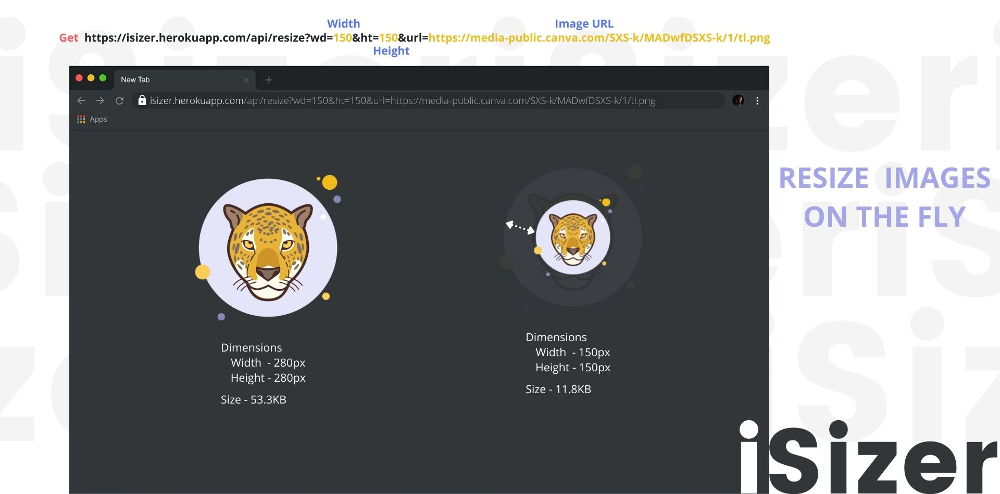

<p align="center">
  
</p>

### Resizes the image based on the given dimension on the fly hence reducing the effort of manual resizing or maintaining different versions of the image.

---

## API Reference

#### Resize image

```http
  GET https://isizer.herokuapp.com/api/resize?wd=${width}&ht=${height}&url=${url}
```

| Parameter | Type      | Description                                 |
| :-------- | :-------- | :------------------------------------------ |
| `width`   | `integer` | **Required**. Width _(px)_ of needed image  |
| `height`  | `integer` | **Required**. Height _(px)_ of needed image |
| `url`     | `string`  | **Required**. URL of image to resize        |

## Demo

[View Demo](https://isizer.herokuapp.com/api/resize?wd=250&ht=250&url=https://media-public.canva.com/SXS-k/MADwfDSXS-k/1/tl.png)
